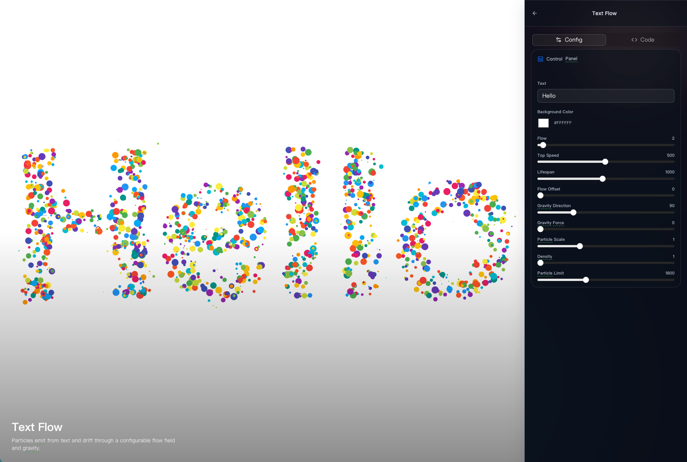
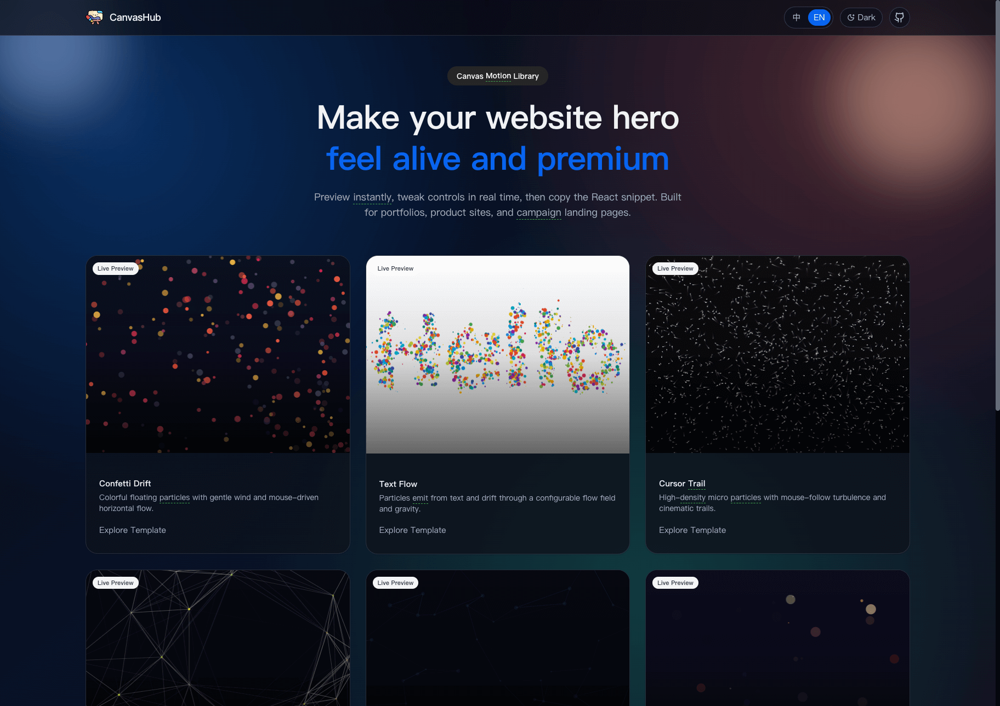
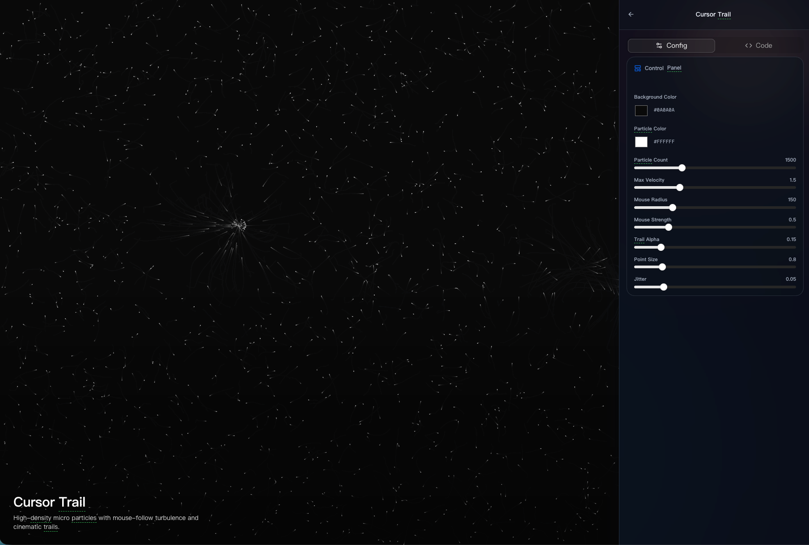

# CanvasHub

<p align="center">
  
</p>

<p align="center">
  A curated gallery of interactive canvas backgrounds, built for modern landing pages.
</p>

<div style="display: flex; gap: 1rem;">
  
  
  
</div>

## Why CanvasHub

CanvasHub is designed as both:

- A **visual playground** for trying animated canvas backgrounds.
- A **code generator** that outputs copy-ready HTML/JavaScript.
- A **scalable architecture** for adding new effects with consistent APIs.

If you are building portfolio sites, product pages, or campaign pages, this repo helps you ship high-quality background motion faster.

## Included Effects

| ID | Effect | Description |
| --- | --- | --- |
| `confetti` | Confetti Drift | Floating colorful particles with wind + pointer influence |
| `text-flow` | Text Flow | Particles emitted from text in a flow-field |
| `cursor-trail` | Cursor Trail | Dense micro-particles with cinematic trailing |
| `edge-link` | Edge Link | Edge-spawned dots that pulse and connect by distance |
| `particles` | Network Particles | Interactive point network with drift and cursor response |
| `stardust-burst` | Stardust Burst | Soft cosmic burst particles with configurable decay |
| `fireworks-burst` | Fireworks Burst | Click/tap explosion with ring shockwave |

## Quick Start

```bash
npm install
npm run dev
```

Then open the local Vite URL (usually `http://localhost:5173`).

### Useful Scripts

```bash
npm run dev      # local development
npm run lint     # eslint
npm run build    # type-check + production build
npm run preview  # preview production build
```

## Project Structure

```text
src/
  backgrounds/
    <effect-name>/
      types.ts     # typed config + control schema
      render.ts    # runtime canvas renderer
      codegen.ts   # copy-ready HTML/JS output
      index.ts     # BackgroundModule registration
    index.ts       # all effect modules
  components/
    CanvasBackground.tsx
    ConfigPanel.tsx
    CodeRenderer.tsx
  pages/
    GalleryPage.tsx
    DemoDetailPage.tsx
  i18n.ts
  types/index.ts
```

## Add Your Own Effect

1. Create `src/backgrounds/<your-effect>/`.
2. Implement:
   - `types.ts`: config interface + default config + config schema
   - `render.ts`: animation loop + cleanup + `updateConfig`
   - `codegen.ts`: copy-ready standalone snippet
   - `index.ts`: export `BackgroundModule`
3. Register module in [`src/backgrounds/index.ts`](./src/backgrounds/index.ts).
4. Add i18n labels in [`src/i18n.ts`](./src/i18n.ts) if needed.

## Contributing

Issues and PRs are welcome.

- Keep each new effect self-contained inside its own folder.
- Avoid `any` where possible.
- Ensure `npm run lint` and `npm run build` pass before PR.

## License

MIT License. See [`LICENSE`](./LICENSE).
